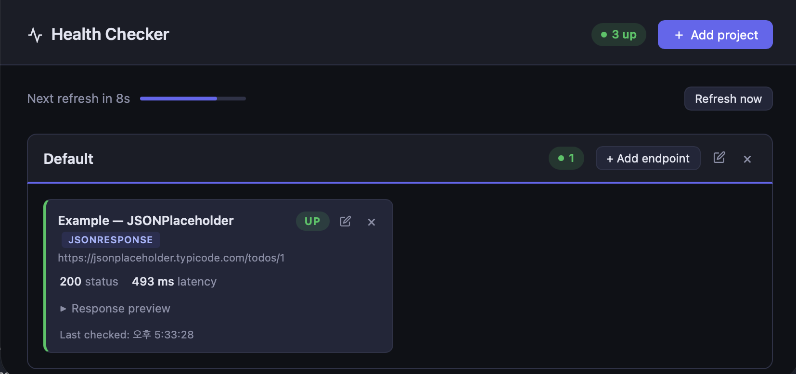

# healthcheck

A lightweight CLI tool for monitoring APIs and webpages. Define your endpoints in a JSON config, run `healthcheck`, and a live browser dashboard opens automatically.

<p align="center">
  
</p>

---

## Installation

```bash
# install via pipx or uv
cd healthchecker
pipx install --editable .
uv tool install --editable .
```

---

## Quick start

```bash
# Run from any directory — auto-creates healthcheck.json if missing
healthcheck
```

The dashboard opens at `http://localhost:8080` and auto-refreshes on every poll interval.

---

## Config file

`healthcheck.json` is looked up in this order:

1. `--config <path>` (explicit flag)
2. `./healthcheck.json` (current directory)
3. `<repo>/healthcheck.json` (package directory, **auto-created** if missing)
4. `~/.healthcheck.json`

### Full structure

```json
{
  "poll_interval": 30,
  "server_port": 8080,
  "projects": [
    {
      "name": "My Project",
      "base_url": "https://api.example.com",
      "headers": {
        "Authorization": "Bearer token"
      },
      "endpoints": [
        {
          "name": "Health",
          "path": "/health",
          "type": "json",
          "expected_status": 200,
          "timeout": 5,
          "headers": {
            "X-Custom": "value"
          }
        }
      ]
    }
  ]
}
```

### Project fields

| Field | Required | Description |
|---|---|---|
| `name` | ✓ | Display name |
| `base_url` | | Default URL prefix for all endpoints |
| `headers` | | Headers sent with every endpoint request in this project |
| `endpoints` | | List of endpoints |

### Endpoint fields

| Field | Required | Description |
|---|---|---|
| `name` | ✓ | Display name |
| `url` | ✓ (or `path`) | Full URL |
| `path` | ✓ (or `url`) | Path relative to project `base_url` |
| `type` | | Response type (default: `json`) |
| `expected_status` | | Expected HTTP status code (default: `200`) |
| `timeout` | | Request timeout in seconds (default: `5`) |
| `headers` | | Per-endpoint headers — override project headers for the same key |

### Header inheritance

Endpoint headers are merged on top of project headers at request time:

```
final headers = { ...project.headers, ...endpoint.headers }
```

---

## Endpoint types

| Type | FastAPI equivalent | Validates | Card shows |
|---|---|---|---|
| `json` | `JSONResponse` | Status code + parseable JSON | Collapsible JSON preview |
| `html` | `HTMLResponse` | Status code | `<title>` tag |
| `text` | `PlainTextResponse` | Status code + `text/*` Content-Type | Text preview |
| `image` | `FileResponse` (image) | Status code + `image/*` Content-Type | Inline image |
| `file` | `FileResponse` | Status code + `Content-Disposition` | Filename, content-type, size |
| `redirect` | `RedirectResponse` | Does **not** follow — checks 3xx status | `→ Location` URL |
| `ping` | `Response` | Status code only | — |

---

## CLI reference

```bash
# Start the dashboard (default command)
healthcheck
healthcheck serve --port 9090 --no-browser
healthcheck --config ~/myconfig.json

# List all projects and endpoints
healthcheck list

# One-shot check without starting the server
healthcheck check
healthcheck check "Health"

# --- Projects ---
healthcheck project add "My Project" --base-url https://api.example.com
healthcheck project add "My Project" --base-url https://api.example.com \
  --header "Authorization: Bearer token"
healthcheck project remove "My Project"

# --- Endpoints ---
# Add to a project (path resolved against base_url)
healthcheck add "Health" /health --project "My Project"

# Add with full URL
healthcheck add "External" https://other.com/status --project "My Project"

# Add with options
healthcheck add "Docs" /docs \
  --project "My Project" \
  --type html \
  --expected-status 200 \
  --timeout 8 \
  --header "X-Key: value"

# Remove an endpoint
healthcheck remove "Health" --project "My Project"
```

---

## Browser dashboard

The dashboard groups endpoints by project and auto-refreshes every `poll_interval` seconds.

### Features

- **Add project** — set name, base URL, and default headers
- **Add endpoint** — set name, URL or path, type, expected status, timeout, and per-endpoint headers
- **Edit** (✏ icon) — modify any project or endpoint in place; saves immediately
- **Remove** (× icon) — removes project or endpoint with a confirmation dialog
- **Status badges** — `UP` / `DOWN` / `PENDING` with latency and HTTP code per card
- **Type-aware cards** — images render inline, redirects show the target URL, files show filename and size, JSON/text show a collapsible preview

### API routes

The dashboard communicates with a local REST API. You can also call these directly:

```
GET    /api/status
POST   /api/projects
PUT    /api/projects/<name>
DELETE /api/projects/<name>
POST   /api/projects/<project>/endpoints
PUT    /api/projects/<project>/endpoints/<name>
DELETE /api/projects/<project>/endpoints/<name>
```
